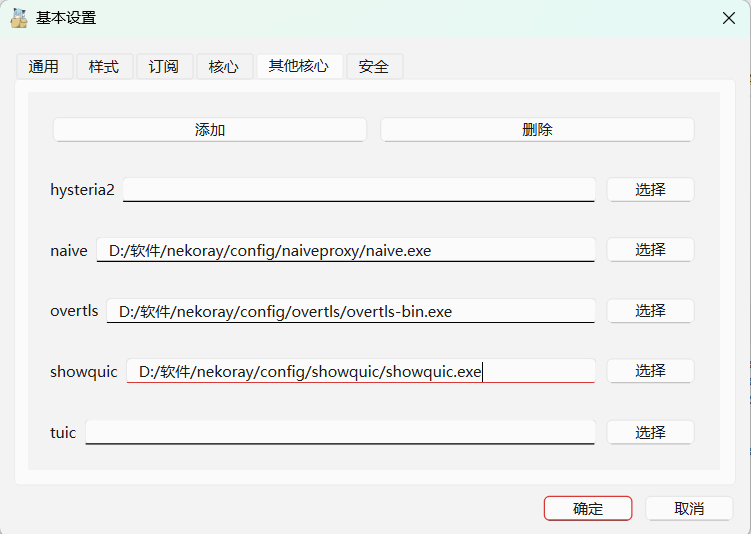

Window usage tutorial 
# 1.v2rayN
Download latest version of address: https://github.com/2dust/v2rayN/releases 
@ 1.2 Add core  
After downloading, locate the bin folder in the installation directory and create a new file named "shadowquic". Then, download the latest version from https://github.com/spongebob888/shadowquic/releases. Find the Windows version as shown in the image below. 

After downloading, rename the file to shadowquic.exe. 
@ 2.2 Add configuration file and start 
Open V2rayN as shown in the image below. Open the configuration options - add custom configuration. 
 
The alias can be any name. Select the Shadowquic client configuration file: https://github.com/spongebob888/shadowquic/blob/main/shadowquic/config_examples/client.yaml; select Shadowquic as the core. 
 
The SOCKS port is configured in the configuration file. After clicking OK, select the active node as shown in the image below. 
 
Configure the system agent automatically in the software settings, then click the menu to restart the service.
# 2.nekobox
Download address: https://github.com/MatsuriDayo/nekoray/releases/tag/4.0.1
## 2.1 Add core
Toolbar-Preferences-Basic configuration
Switch to other cores
Add core name shadowquic
Download the latest version from https://github.com/spongebob888/shadowquic/releases
shadowquic-x86_64-windows.exe
Go to the following path and browse to select

## 2.2 Add configuration
After starting the software, right-click and manually enter the configuration as shown below

Enter according to the prompts
Reference client configuration
[Client configuration](https://github.com/spongebob888/shadowquic/blob/main/shadowquic/config_examples/client.yaml)
Modify and paste the above picture into the picture
Then start and check the system proxy

