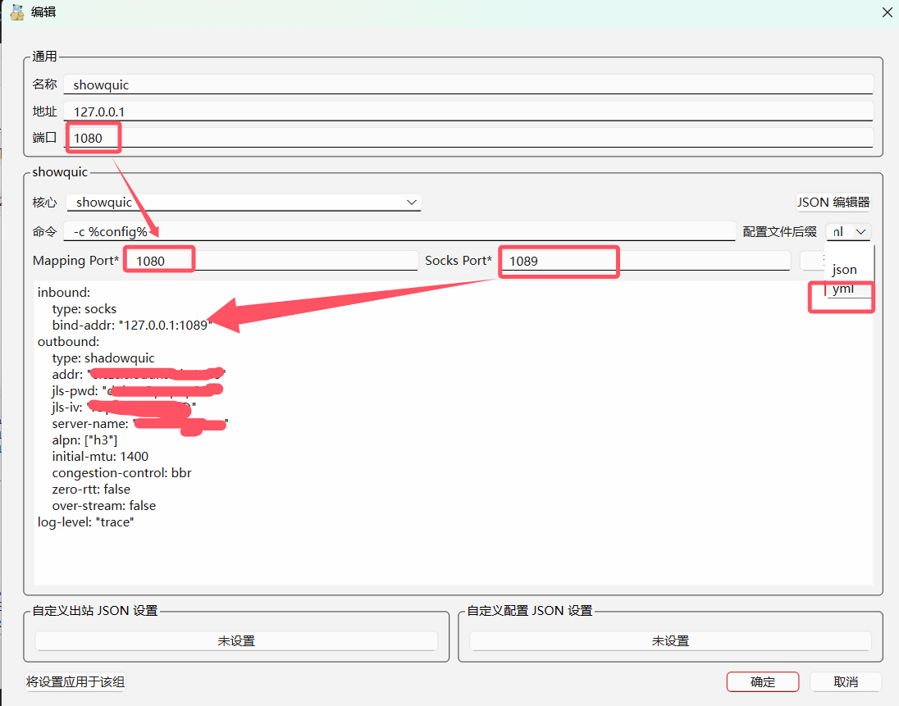

Window usage tutorial 
# 1.nekobox
Download address: https://github.com/MatsuriDayo/nekoray/releases/tag/4.0.1
## 1.1 Add core
Toolbar-Preferences-Basic configuration
Switch to other cores
Add core name shadowquic
Download the latest version from https://github.com/spongebob888/shadowquic/releases
shadowquic-x86_64-windows.exe
Go to the following path and browse to select

## 1.2 Add configuration
After starting the software, right-click and manually enter the configuration as shown below

Enter according to the prompts
Reference client configuration
[Client configuration](https://github.com/spongebob888/shadowquic/blob/main/shadowquic/config_examples/client.yaml)
Modify and paste the above picture into the picture
Then start and check the system proxy